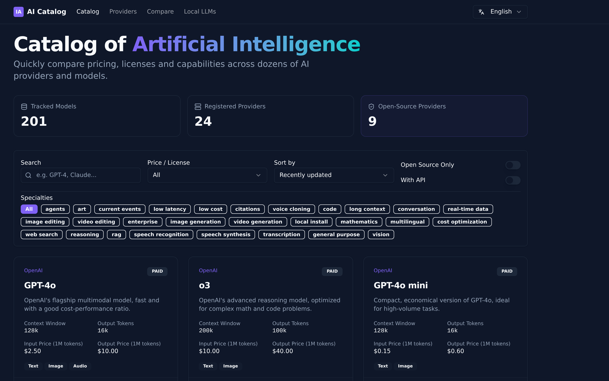
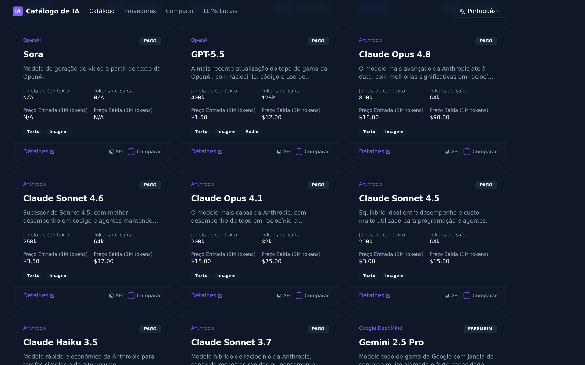

> [English](README.md) · [Português](README.pt.md) · [Español](README.es.md) · [Français](README.fr.md) · [Deutsch](README.de.md) · 🌐 **中文**

<h1 align="center">🧠 AI 目录</h1>

  <b>AI 目录</b> — 在一个地方搜索并比较各家提供商的<b>付费、免费和本地</b> AI 模型。

  

  

---

## 我们为什么要做这个

每次需要挑选模型时，我们总是在原地打转：价格在一个页面上，许可协议在另一个页面上，功能特性散落在各种博客文章里，而免费或可自行运行的选项则完全藏在别处。要把一个付费 API 和一个免费额度以及一个可以在自己电脑上运行的模型放在一起比较，往往意味着打开十几个标签页，再加上大量的猜测。

于是我们做了这个工具，**只是为了让自己的生活更轻松一些**——一个可以搜索和比较**付费、免费和本地** AI 模型的地方，把真正重要的信息并排呈现。

## 它能做什么

- 🔎 **搜索与筛选**——覆盖 **24 家提供商、200 多个模型**
- 💸 **付费、免费与开放权重**——清楚标注，绝不隐藏
- 📊 **真正重要的信息**——真实定价、上下文窗口、模态和专长
- ⚖️ **并排比较**——让候选模型正面对比
- 💻 **本地大语言模型**——专门板块，提供在**自己电脑**上运行模型所需的工具
- 🌍 **六种语言**——English、Português、Español、Français、Deutsch、中文

## 立即使用

👉 **[catalog.devs.foundation](https://catalog.devs.foundation)** —— 已上线，免费，无需注册。

  

## 关于 Dev's Foundation

**Dev's Foundation** 是首个让众多 AI 模型——跨越众多设备——共享**一个持久化、通过 git 同步的大脑**，并以**共识**方式做出决策的系统。这个目录正是这一使命的一部分：让快速变化的 AI 模型世界变得**清晰可读**——有哪些模型、价格如何、哪些免费、哪些可以自行运行。

> **N models. N devices. One brain.**

---

由 **Dev's Foundation** 团队打造 · [devs.foundation](https://devs.foundation)
